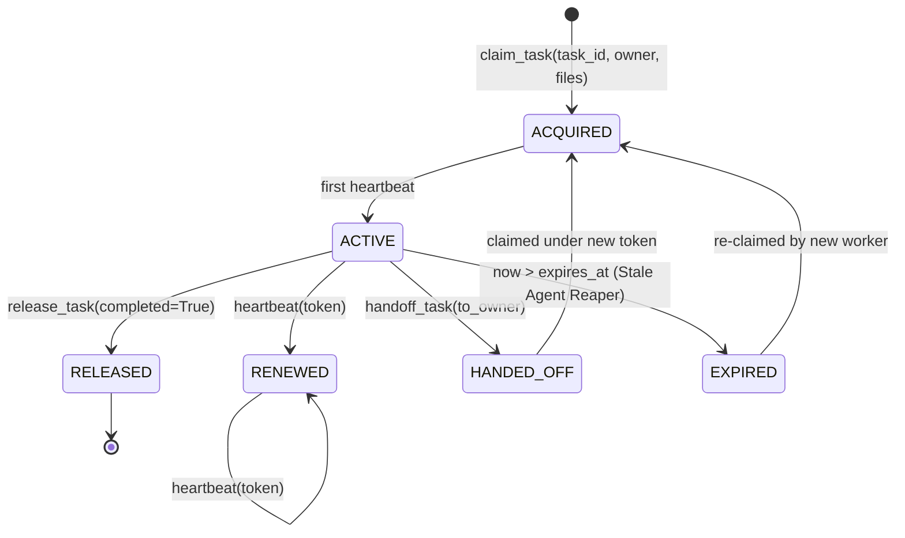

# Multi-Agent Coordination: Task Leases, Ownership, & Conflict Governance

This document establishes the architecture and operational protocols for coordinating multiple asynchronous LLM agents within the AgentFlow SDLC lifecycle.

---

## State Locking vs. Logical Leases

| Property | State Locking (`fcntl.flock`) | Multi-Agent Coordination (Task Leases) |
|---|---|---|
| **Scope** | Operating System process level | Logical Agent / Subagent identity |
| **Timescale** | Microseconds to milliseconds | Minutes to hours (e.g. 10m TTL) |
| **Purpose** | Prevent concurrent file write corruption | Prevent duplicate work, file thrashing, and abandonment |
| **Deadlock Risk** | Kernel process hang | Handled via lazy TTL expiration & stale-agent reaping |
| **Dependencies** | POSIX OS primitive | Pure Python standard library (`uuid`, `time`, `json`) |

---

## Architecture: Distributed Task Leases

```
                                  ┌──────────────────────────────┐
                                  │   Multi-Agent Coordinator    │
                                  │                              │
                                  │   Lease Manager & Registry   │
                                  │   Conflict Detection Engine  │
                                  │   Stale-Agent Reaper         │
                                  └──────────────┬───────────────┘
                                                 │
                   ┌─────────────────────────────┼─────────────────────────────┐
                   │                             │                             │
                   ▼                             ▼                             ▼
       ┌──────────────────────┐      ┌──────────────────────┐      ┌──────────────────────┐
       │       Agent A        │      │       Agent B        │      │       Agent C        │
       │    (Worker: TDD)     │      │    (Worker: TDD)     │      │   (Reviewer: Judge)  │
       │                      │      │                      │      │                      │
       │ Claims: Task 1.1     │      │ Claims: Task 1.2     │      │ Awaiting Handoff     │
       │ Files: [auth.py]     │      │ Files: [db.py]       │      │ Reviews: T1.1 + T1.2 │
       │ Lease: ACQUIRED (TTL)│      │ Lease: ACQUIRED (TTL)│      │                      │
       └──────────┬───────────┘      └──────────┬───────────┘      └──────────▲───────────┘
                  │                             │                             │
                  │                             │                             │
                  └─────────────────────── Orderly Handoff ───────────────────┘
```

---

## The Lease Lifecycle State Machine



### 1. Task Acquisition (`claim_task`)
- Worker agent requests an exclusive lease on a task from `tasks.md`.
- Coordinator validates:
  1. No active, unexpired lease exists for this task.
  2. No active lease across concurrent tasks targets overlapping source files.
  3. Maximum concurrent worker limit is not breached.
- Returns `lease_token` (cryptographically unguessable UUID) and `expires_at` deadline.

### 2. Heartbeat & Renewal (`heartbeat_lease`)
- While actively implementing code, the worker sends periodic heartbeats (recommended every 120s).
- Extends the lease deadline by `ttl_seconds`.

### 3. Resource Conflict Detection (`detect_conflicts`)
- Strict set intersection: `proposed_files & active_leased_files`.
- If another active worker holds `[src/auth.py]`, subsequent workers attempting to claim tasks touching `src/auth.py` are rejected with `FILE_OVERLAP`.

### 4. Stale-Agent Reclamation (`reap_stale_leases`)
- If an agent crashes, runs out of context, or hangs, its lease expires.
- Any subsequent agent claim or CLI sweep (`agentflow lease reap`) lazily reclaims expired tasks back to the available pool.

### 5. Structured Maker-Checker Handoff (`handoff_task`)
- When Maker (TDD developer) finishes implementation:
  - Invokes `handoff_task` with its `lease_token` and target `to_owner` (e.g. Review Judge).
  - Old token is invalidated immediately.
  - New lease is minted for Checker with fresh token.
  - Provenance event is recorded in the transaction ledger.

---

## CLI Reference

```bash
# Claim a task lease
agentflow lease claim 1.1 --owner agent-tdd-1 --files src/service.py,tests/test_service.py --ttl 600

# Heartbeat an active lease
agentflow lease heartbeat 1.1 --token <token>

# Hand off task from Maker to Checker
agentflow lease handoff 1.1 --from agent-tdd-1 --to agent-review-judge --token <token> --reason "Implementation and unit tests complete"

# Release lease upon completion
agentflow lease release 1.1 --token <new_token> --completed

# Inspect all leases
agentflow lease list --active

# Prune stale/abandoned leases
agentflow lease reap
```
